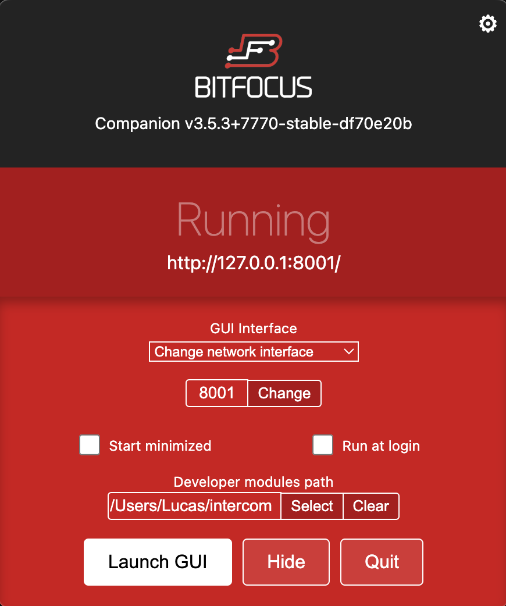

# companion-module-eyevinn intercom

Eyevinn Open Intercom Companion Module is a tool that allows you to use the Intercom controls (mute, push to talk, etc...) with an Elgato Streamdeck. This requires having an Eyevinn Intercom running.

## Running Bitfocus Companion

### Instalation

To run the Bitfocus Companion Module you need to have Bitfocus Companion installed locally. You can install it [here](https://user.bitfocus.io/download).

### Starting Bitfocus Companion

Once you have Bitfocus Companion installed, open it. You should see this.

 

You can specify the port you want the Bitfocus Companion UI to be hosted on. To start the app simply press "Launch GUI".

## Running the module locally

If you have a local version of a module you wish to run simply add the PARENT folder path to the "Developer module path" when starting Bitfocus Companion.

### Loading in the module

Executing a `yarn` command should perform all necessary steps to develop the module, if it does not then follow the steps below.

The module can be built once with `yarn build`. This should be enough to get the module to be loadable by companion.

### Development

While developing the module, by using `yarn dev` the compiler will be run in watch mode to recompile the files on change.

## Using the module

[Here](https://www.google.com) is a guide on how to use the Intercom and configure the Companion Module. There are some predefined configurations (page layouts) available in the "configs" folder in this repo. You can easily import them into Bitfocus.

To use the Eyevinn Open Intercom Module, under the "Connections" tab search for "Eyevinn Intercom" and the press "Add" button. You can then specify on what port you wish to expose the Websocket Server that communicates with the Intercom.

Once you have added the module, to configure your Elgato Streamdeck simply drag and drop preset buttons onto your page under the "Buttons" tab.

### Presets

#### Global Buttons

- Status - Displays the connection status between the module and the Intercom
- Open Intercom - Opens the intercom website (requires you to configure the URL path in the button)
- Global Input Mute - Mute/Unmmute all calls

#### Call 1-8 Buttons

These buttons allow you to use the controls for a call at a specific index. The first call in your list of calls will be Call 1. The name of the call line will be displayed on the button once you are connected to the Interom.

- Input Mute - Mute/Unmute microphone
- Output Mute - Mute/Unmute speaker
- PTT - Push to talk (unmute the microphone while pressed)
- Volume up
- Volume down

#### Call X Buttons

Here you can see buttons named Call 1 to 8. Holding down one of these buttons allows you to use the controls for that call with the "X" buttons. The name of the call line will be displayed on the button once you are connected to the Interom. \
E.g. holding down "Call 2" and then pressing "Volume up X" will increase the volume of Call 2.

## Actions

You can also create your own buttons using our Actions.

- Open Intercom - specify the URL
- Toggle Global Mute
- Set Selected Channel - for using the Call X Buttons

For the following actions you can specify the call index or leave it empty to use in combination with the selected channel. Leaving the channel index empty is equivalent to setting it to 0.

- Toggle Input Mute
- Toggle Output Mute
- Push To Talk Start
- Push To Talk Stop
- Increase Volume
- Decrease Volume

## Feedbacks

You can add Feedbacks to your buttons to get their state or set predefined styles. Each of these feedbacks get updated when receiving a relevant message from the Intercom.

- Get Global Mute Button Status - returns true if global mute is inactive

The following feedbacks use channelIndex as an option

- Is Button Disabled - returns true if the Intercom is disconnected or there is no call at that index
- Get Button Channel Name - sets the text of the button to the call line name at that index
- Get Input Mute Button Status - sets the entire style block for the input mute button at that index. This includes the disabled state.
- Get Ouput Mute Button Status - sets the entire style block for the output mute button at that index. This includes the disabled state.

## Additional Information

See [HELP.md](./companion/HELP.md) and [LICENSE](./LICENSE)
